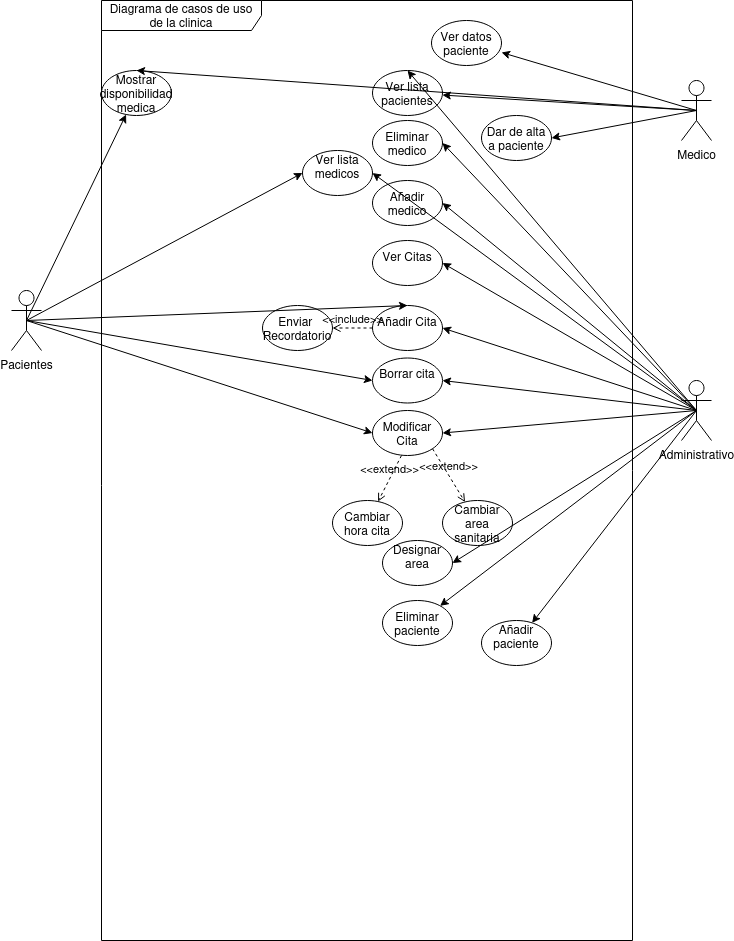

# Guion de la practica 5 

## Apartado 1: Requisitos Funcionales:

### RF1:Gestión de citas:

- **RF1.1** Ver citas.
- **RF1.2** Añadir citas.
- **RF1.3** Borrar cita.
- **RF1.4** Modificar cita.
- **RF1.5** Cambiar hora cita.
- **RF1.6** Cambiar area sanitaria.
- **RF1.7** Mostrar disponibilidad medica.
- **RF1.8** Enviar recordatorio.

### RF2:Gestión de pacientes:

- **RF2.1** Ver lista de pacientes.
- **RF2.2** Añadir paciente.
- **RF2.3** Eliminar paciente.
- **RF2.4** Ver datos de paciente.
- **RF2.5** Ver historial de paciente.
- **RF2.6** Dar de alta a paciente.

### RF3:Gestión de doctores:

- **RF3.1** Ver lista de medicos.
- **RF3.2** Añadir medico.
- **RF3.3** Eliminar medico.
- **RF3.4** Designar area medico.
- **RF3.5** Dar de alta a medico

## Actores y Casos de uso:

1. **Administrativo**: Gestiona tanto medicos como pacientes.
2. **Medico**: Gestiona a los pacientes y sus datos.
3. **Paciente**: Gestiona caracteristicas de la cita y elige el area.

### Actor 1: Administrativo CU :

### Actor 2: Medico CU:

### Actor 3: Paciente CU :

- **RF1.1** Ver citas.
- **RF1.2** Añadir citas.
- **RF1.3** Borrar cita.
- **RF1.4** Modificar cita.
- **RF1.5** Cambiar hora cita.
- **RF1.6** Cambiar area sanitaria.
- **RF1.7** Mostrar disponibilidad medica.
- **RF3.1** Ver lista de medicos.

### Tabla de casos de uso:

|Nº CU |Actor(es)                                |Nombre                        |Descripcion                                      |RF
|------|-----------------------------------------|-----------------             |-------------------------------------------------|--
|CU-1  |Administrativo,Paciente,Medico           |Ver cita                      |Permite ver las citas de un paciente             |RF1.1
|CU-2  |Administrativo,Paciente                  |Añadir cita                   |Permite añadir una cita                          |RF1.2
|CU-3  |Administrativo,Paciente                  |Borrar cita                   |Permite borrar una cita de un paciente           |RF1.3
|CU-4  |Administrativo,Paciente                  |Modificar cita                |Permite modificar la cita de un paciente         |RF1.4
|CU-5  |Administrativo,Paciente                  |Cambiar hora cita             |Permite vambiar la hora de la cita               |RF1.5
|CU-6  |Administrativo,Paciente                  |Cambiar area sanitaria        |Permite cambiar el area sanitaria                |RF1.6
|CU-7  |Paciente,Medico                          |Mostrar disponibilidad medica |Permite mostrar la disponibilidad medica         |RF1.7
|CU-8  |Administrativo,Medico                    |Enviar recordatorio           |Permite enviar un recordatorio de la cita        |RF1.8
|CU-9  |Administrativo,Medico                    |Ver lista de pacientes        |Permite ver la lista de pacientes                |RF2.1
|CU-10 |Administrativo                           |Añadir paciente               |Permite añadir un paciente                       |RF2.2
|CU-11 |Administrativo                           |Eliminar Paciente             |Permite borrar un paciente de la lista           |RF2.3
|CU-12 |Paciente                                 |Ver datos paciente            |Permite ver los datos de un paciente             |RF2.4
|CU-13 |Medico                                   |Ver historial paciente        |Permite ver el historial de un paciente          |RF2.5
|CU-14 |Medico                                   |Dar de alta paciente          |Permite dar de alta un paciente                  |RF2.6
|CU-15 |Administrativo,Paciente                  |Ver lista medicos             |Permite ver la lista de los medicos              |RF3.1
|CU-16 |Administrativo                           |Añadir medico                 |Permite añadir a un medico                       |RF3.2
|CU-17 |Administrativo                           |Eliminar medico               |Permite borrar un medico de la lista             |RF3.3
|CU-18 |Administrativo                           |Designar area                 |Permite designar un area a un medico             |RF3.4
|CU-19 |Administrativo                           |Enviar Recordatorio           |Permite enviar un recordatorio de la cita        |RF3.5

