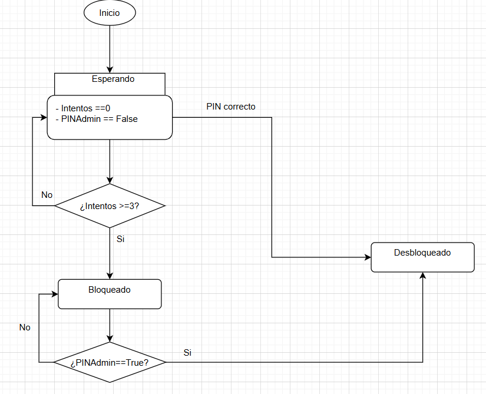

# Practica 8

## Investigacion

- **Prueba unitaria** que es y para que sirve : 

Es una forma automatizada de verificar el correcto funcionamiento de las partes mas aisladas de un programa ya sean funciones metodos o clases de forma aislada

- **TDD** en que consiste y cuales son sus fases :

Es una metodologia de programacion o desarrollo de software se caracteriza porque se escriben primero las pruebas y luego se desarrolla el codigo, sus fases son las siguientes:
Desarrollo de la prueba, Escritura del codigo, Validacion de las pruebas y Refactorizacion.

- **AAA** en que consiste cada fase : 

Organizar:Donde se prepara todo lo necesario para ejecutar la prueba y asegurarse de que produzca resultados precisos

Acto: Es el paso donde se ejecuta la funcionalidad especifica que se desea probar 

Afirme: Es el paso donde se verifica que el resultado de la prueba unitaria coincida con lo esperado

- **Valores limite** que son y porque son importantes en las pruebas : Son los valores maximos y minimos que soportan las entradas de datos, son importantes para valorar como se comporta el programa ante resultados extremos.

- **Test de robustez** qué se comprueba con este tipo de test: Con este tipo de test se busca comprobar como reacciona el programa ante valores extremos, valores erroneos y condiciones extremas.

- **Excepciones** qué son y cuándo es preferible lanzar una excepción en lugar de
controlar el error de forma silenciosa : Las excepciones son mecanismos para comprobar que se ha realizado un error en un programa , es preferible lanzar una excepcion cuando la situacion no se puede controlar e impide el correcto funcionamiento del programa.

- **Falsos positivos y falsos negativos en tests** qué son y por qué son peligrosos: Son variaciones en los resultados de los test , es decir , cuando un test falla cuando el codigo esta correcto y viceversa , cuando un test pasa pero el codigo realmente esta incorrecto , son muy peligrosos ya que realmente engañan al desarrollador , luego dara problemas a la larga y obligara a una refactorizacion de los test o una refactorizacion de el codigo para que el programa se comporte adecuadamente.

## Analisis y diseño

1. Responda a las siguientes cuestiones:

- ¿Qué estados puede tener el sistema? : 3 , Esperando, Bloqueado y Desbloqueado.

- ¿Qué acciones puede realizar el usuario?:  Introducir combinacion mientras esta en el estado esperando, Introducir el PIN de admin cuando el estado esta bloqueado

- ¿Qué ocurre si se intenta registrar un intento fallido cuando el sistema ya está
bloqueado? Nada , se tiene que introducir el pin de admin para salir de dicho estado.

2. Diagrama de estados

## Diseño de test

- El contador comienza a 0: **Estado inicial**
- El sistema no está bloqueado al iniciarse: **Estado inicial**
-  Registrar un intento fallido incrementa el contador: **Funcionamiento**
- Registrar varios intentos fallidos incrementa correctamente el contador: **Funcionamiento**
- Un intento correcto reinicia el contador a 0: **Funcionamiento**
- Alcanzar exactamente 3 intentos fallidos bloquea el sistema: **Valores limite**
- Un intento correcto después del bloqueo desbloquea el sistema: **Funcionamiento**
- Reiniciar el contador cuando ya está a 0 no provoca errores ni cambios de estado: **Robustez**
- Varias operaciones válidas consecutivas mantienen un estado coherente: **Robustez**
- Intentar registrar un intento fallido cuando el sistema está bloqueado provoca una
excepción: **Excepcion**

## Errores NetBeans
 NetBeans me da un error con los plugins , ni intentando con la IA arreglarlo he podido , no puedo hacer ni capturas ni probarlo, he probado a reinstalarlo pero no funciona.
