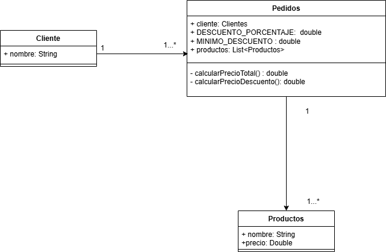

# Clean Code

# Análisis

1. El programa añade una lista de clientes ,producto y precio que en funcion de el precio de lo que compre el usuario le hace un descuento porcentual

2. Problemas de diseño o clean code:

- (a) Nomenclatura: En las lineas 19 y 20 las variables linea y partes no tienen una nomenclatura adecuada ya que son confusas , tambien las lienas 15 y 24 , ya que al haber dos precios no se deberian de llamar así.

- (b) Estructura: linea 17, no es adecuado usar un for tradicional , para un arraylist no es lo adecuado

- (c) Responsabilidad: Lineas 7-39 toda la responsabilidad recae en el main

- (d) Acoplamiento: linea 24 al haber usado anteriormente en las lineas 11,12,13 strings para introducir los datos ahora dependes de utilizar parseDouble para incluir el precio

- (e) Cohesion: En el bucle for de las lineas 17 a 34 hay un claro problema de cohesion , ya que no tiene una unica responsabilidad bien definida, realiza dos funcionalidades que no tienen nada que ver

- (f) Legibilidad: Linea 35: número magico 0.15

- (g) Tipo de datos incorrecto: En la linea 9 , al querer introducir varios tipos de datos diferentes el arraylist no es lel tipo de dato que necesitas en este caso

3. Tecnicas de refactorizacion:

- (a) : Cambiar nombres por precioInicial, precioFinal , linea por elementos , y partes por elementosSeparados

- (b): cambiar for por for each

- (c) : Crear clase para recaer funcionalidad en varios sitios

- (d) : No añadir asi ese tipo de datos para no tener que forzar los tipados

- (e) :Hacer varios bucles, cada uno que tenga una funcionalidad

- (f) : Crear constantes

- (g) : Cambiar arraylist por List

## REFACTORS

En el segundo refactor no cambio el uso de casting porque despues voy a tener que volver a cambiarlo , no tiene sentido y es muy complicado quitarlo sin hacer mas complejo el codigo

## Diseño

Las relaciones entre las clases estan claras, un cliente puede hacer 1 o muchos pedidos , al igual que un pedido puede incluir 1 o muchos prouctos

